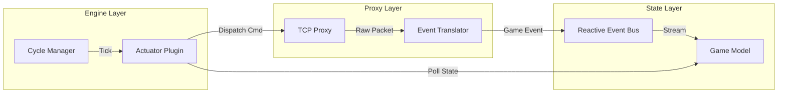

# Sokybot Architecture

This document provides a comprehensive technical overview of the Sokybot application architecture.

## 1. High-Level Overview

Sokybot is a modular, event-driven botting platform for Silkroad Online, built on the **Apache Karaf** OSGi runtime. It employs a **Game Proxy** architecture, positioning itself between the game client and the server to intercept, analyze, and automate game traffic.

### Architectural Layers

```mermaid
graph TD
    subgraph Frontend [Electron / Web Browser]
        UI[React Web UI]
        DevTools[Developer Tools]
    end

    subgraph Backend [OSGi Container - Apache Karaf]
        API[HTTP / WebSocket Layer]
        Engine[Bot Engine / Logic]
        Network[Network Proxy Layer]
        Data[Game Data / Persistence]
    end

    subgraph External
        Client[Game Client]
        Server[Game Server]
    end

    UI <-->|RSocket/WS| API
    DevTools <-->|RSocket/WS| API
    Client <-->|TCP (Silkroad Protocol)| Network
    Network <-->|TCP (Silkroad Protocol)| Server
    Network -->|Events| Engine
    Engine -->|Commands| Network
    Engine -->|State Updates| API
    Data -->|Models| Engine
```

## 2. Core Component Directory

The following table maps logical system components to their physical Maven modules and primary Java namespaces.

| Component | Maven Module | Base Package Namespace |
| :--- | :--- | :--- |
| **Engine Core** | `sokybot-engine` | `org.sokybot.engine.core` |
| **Engine API** | `sokybot-engine-api` | `org.sokybot.engine.api` |
| **Bot Runtime** | `sokybot-runtime` | `org.sokybot.runtime` |
| **Network Proxy** | `sokybot-proxy` | `org.sokybot.proxy` |
| **Security/Crypto** | `sokybot-security` | `org.sokybot.security` |
| **Game Model** | `sokybot-game-model` | `org.sokybot.gamemodel` |
| **Game Events** | `sokybot-game-events` | `org.sokybot.gameevents` |
| **HTTP Server** | `sokybot-http-server` | `org.sokybot.http.server` |
| **Web UI Backend** | `sokybot-webview` | `org.sokybot.webview` |
| **Persistence** | `sokybot-persistence` | `org.sokybot.persistence` |
| **Shared Commons** | `sokybot-commons` | `org.sokybot.commons` |
| **Settings** | `sokybot-settings` | `org.sokybot.settings` |
| **Navigation** | `sokybot-game-navigation` | `org.sokybot.game.navigation` |
| **PK2 Driver** | `sokybot-pk2` | `org.sokybot.pk2` |

## 3. Technology Stack

### Backend (Java 11)
*   **Runtime**: Apache Karaf (OSGi)
*   **Networking**: Netty 4.1 (Async Event-Driven)
*   **Reactive Programming**: Project Reactor (Mono/Flux)
*   **HTTP/WebSocket**: Reactor Netty (Shared HTTP Server)
*   **Protocol**: RSocket (Frontend communication)
*   **Persistence**: Hibernate (JPA), H2 Database (Embedded)
*   **Data Format**: JSON (Jackson), Custom Binary (Silkroad)

### Frontend (TypeScript)
*   **Framework**: React 19
*   **Build Tool**: Vite
*   **Styling**: TailwindCSS
*   **Components**: Radix UI Primitives, Lucide Icons

## 4. Module Breakdown

The codebase is organized into multi-module Maven projects under functional categories.

### 4.1 Core Modules (`core/`)
These modules form the brain of the application.

*   **`sokybot-runtime`**: Manages the lifecycle of bot instances (Machines) and groups. It orchestrates the creation of bot contexts and handles the OSGi service wiring between modules.
*   **`sokybot-engine`**: Implements the state machines and core logic loops (Cycles). It provides the execution engine for Actuators discovered via OSGi.
*   **`sokybot-engine-api`**: Primary contract module. Defines interfaces like `IDispatcher`, `ICycleDefinition`, and `IWorkflowContext` to ensure decoupling between the engine and plugins.

### 4.2 Network Layer (`network/`)
Handles all external TCP communication with the game.

*   **`sokybot-proxy`**: A Netty-based TCP proxy acting as a "Man-in-the-Middle" (MITM) between the client and server.
*   **`sokybot-security`**: Implements Silkroad's security layer including Blowfish encryption and CRC/Count handshakes.
*   **`sokybot-packet-sniffer`**: Real-time packet analysis and development tool.

### 4.3 Game Data (`game/`)
Manages game assets, protocol definitions, and world state.

*   **`sokybot-game-events`**: Maps raw packet OpCodes to strongly-typed Java Events (e.g., `ChatMessageEvent`, `MonsterSpawnEvent`).
*   **`sokybot-game-model`**: Holds the current world state (Character, Items, Skills, Mobs) updated via the Reactive Event Bus.
*   **`sokybot-game-navigation`**: Implements pathfinding and navigation mesh (`navmesh`) logic for autonomous movement.

### 4.4 User Interface (`ui/`)
The interface layer, decoupled from the backend logic.

*   **`sokybot-http-server`**: Shared Reactor Netty host (Port 8182). Serves frontend assets and manages RSocket WebSocket upgrades.
*   **`sokybot-webview`**: The primary bot management interface.
*   **`sokybot-dev-tools`**: OSGi service inspection and metrics monitoring.

## 5. Component Relationships

The following diagram illustrates the primary data flow and service dependencies during active botting.



## 6. Design Principles

### 6.1 State Distillation
Actuators do not listen to raw packets. Instead, the system distillates packets into a centralized **Game Model**. Actuators poll this model to make decisions, ensuring logic is based on a consistent world view.

### 6.2 Whiteboard Pattern (OSGi)
Modules interact primarily via the OSGi service registry. Components like `IActuator` or `IRSocketHandler` register themselves, and their respective managers discover them dynamically, allowing for hot-swapping and modular extension.

### 6.3 Reactive Communication
The system uses **Project Reactor** for internal data flow and **RSocket** for frontend/backend interaction, providing backpressure-aware, non-blocking communication throughout the stack.
