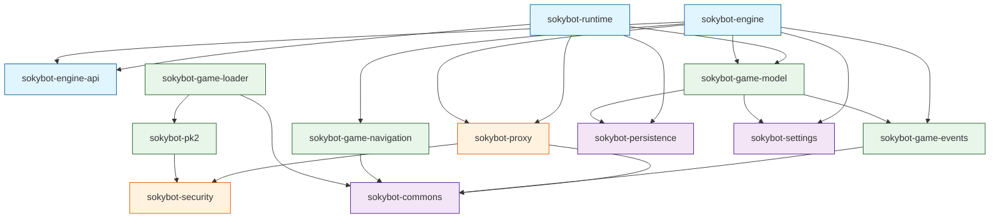

# Sokybot Module Dependencies

This document details the dependency graph of the Sokybot application, explaining how modules relate to each other and identifying key third-party libraries.

## 1. Dependency Graph

The following diagram illustrates the high-level dependency flow. Arrows indicate "depends on".

## 2. Detailed Module Dependencies

### 2.1 Core Layer (`core/`)

| Module | Depends On (Internal) | Third-Party Libraries |
|--------|----------------------|-----------------------|
| **sokybot-runtime** | `sokybot-engine-api`, `sokybot-game-model` (Ownership), `sokybot-proxy`, `sokybot-persistence`, `sokybot-loader-api` | OSGi Core, SLF4J |
| **sokybot-engine** | `sokybot-engine-api`, `sokybot-game-model` | *None* |
| **sokybot-engine-api** | *None* | *None* |

### 2.2 Network Layer (`network/`)

| Module | Depends On (Internal) | Third-Party Libraries |
|--------|----------------------|-----------------------|
| **sokybot-proxy** | `sokybot-security`, `sokybot-commons` | Netty (Buffer, Transport, Codec) |
| **sokybot-security** | `sokybot-commons` | *None* |

### 2.3 Game Data Layer (`game/`)

| Module | Depends On (Internal) | Third-Party Libraries |
|--------|----------------------|-----------------------|
| **sokybot-game-model** | `sokybot-game-events`, `sokybot-persistence` | Lombok |
| **sokybot-game-events** | `sokybot-commons` | *None* |
| **sokybot-game-navigation**| `sokybot-commons` | *None* |
| **sokybot-pk2** | `sokybot-security`, `sokybot-commons` | *None* |
| **sokybot-game-loader** | `sokybot-loader-api`, `sokybot-commons` | JNA (Java Native Access) |

### 2.4 User Interface Layer (`ui/`)

| Module | Depends On (Internal) | Third-Party Libraries |
|--------|----------------------|-----------------------|
| **sokybot-http-server** | *None* | **Reactor Netty**, Jackson, OSGi |
| **sokybot-webview** | `sokybot-http-server` | RSocket, Reactor Core |
| **sokybot-dev-tools** | `sokybot-http-server`, `sokybot-runtime` | RSocket, Reactor Core |

### 2.5 Infrastructure Layer (`infra/`)

| Module | Depends On (Internal) | Third-Party Libraries |
|--------|----------------------|-----------------------|
| **sokybot-persistence** | `sokybot-commons`, `sokybot-pk2-extractor` | **Hibernate 5.6**, H2 Database, Spring Data JPA |
| **sokybot-settings** | `sokybot-commons` | Jackson |
| **sokybot-commons** | *None* | Apache Commons Lang/IO |

## 3. Key Library Locations

To avoid version conflicts (Jar Hell), major libraries are isolated or shared via specific bundles:

*   **Netty 4.1**: Used by `sokybot-proxy` for game TCP traffic.
*   **Reactor Netty**: Used exclusively by `sokybot-http-server` for the Web UI. It is embedded to avoid conflicts with the core Netty version if they diverge.
*   **Hibernate / H2**: Embedded within `sokybot-persistence` to isolate the ORM classpath.
*   **Jackson**: Shared via `sokybot-jackson` feature (not shown in graph but pervasive).

## 4. Circular Dependency Watch

Potential cycles to be aware of during development:

1.  **Events ↔ Model**: `sokybot-game-model` depends on `sokybot-game-events`. Events should **not** depend on Model.
    *   *Rule*: Events are pure data carriers. Model contains logic.
2.  **Engine ↔ Runtime**: `runtime` creates `engine`, but `engine` should not depend on `runtime` implementation.
    *   *Solution*: Both depend on `sokybot-engine-api`.

## 5. Build Order

The typical reactor build order based on these dependencies is:
1.  Infra (`commons`, `security`)
2.  Game (`pk2`, `events`, `events-api`, `loader-api`)
3.  Persistence & Settings
4.  Game Model & Navigation
5.  Engine API
6.  Proxy
7.  Engine & Runtime
8.  UI (`http-server`, `webview`)

### 6. Recent Refactors
*   **Engine IoC**: `sokybot-engine` now receives `IGameModel` via dependency injection from `sokybot-runtime` instead of creating it internally. This centralized model creation in the runtime layer.
