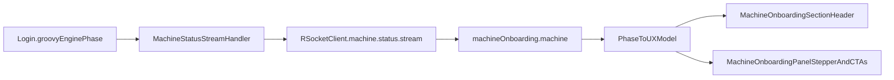

# Login Workflow UX Redesign Plan

## Goals

- Replace raw/internal workflow language with user-facing status text.
- Make current step and next action obvious at all times.
- Add actionable recovery paths for timeout/failure states.
- Keep backend workflow intact; focus on presentation and event enrichment.

## Key Files To Update

- Frontend status strip and onboarding UI:
  - [/home/amr/sokybot-workspace/sokybot-workspace/ui/sokybot-webview/src/main/frontend/src/components/MachineOnboardingSection.tsx](/home/amr/sokybot-workspace/sokybot-workspace/ui/sokybot-webview/src/main/frontend/src/components/MachineOnboardingSection.tsx)
  - [/home/amr/sokybot-workspace/sokybot-workspace/ui/sokybot-webview/src/main/frontend/src/components/MachineOnboardingPanel.tsx](/home/amr/sokybot-workspace/sokybot-workspace/ui/sokybot-webview/src/main/frontend/src/components/MachineOnboardingPanel.tsx)
  - [/home/amr/sokybot-workspace/sokybot-workspace/ui/sokybot-webview/src/main/frontend/src/machines/machineOnboarding.machine.ts](/home/amr/sokybot-workspace/sokybot-workspace/ui/sokybot-webview/src/main/frontend/src/machines/machineOnboarding.machine.ts)
- Frontend transport/types and stream payload handling:
  - [/home/amr/sokybot-workspace/sokybot-workspace/ui/sokybot-webview/src/main/frontend/src/RSocketClient.ts](/home/amr/sokybot-workspace/sokybot-workspace/ui/sokybot-webview/src/main/frontend/src/RSocketClient.ts)
- Backend machine status payload source:
  - [/home/amr/sokybot-workspace/sokybot-workspace/ui/sokybot-webview/src/main/java/org/sokybot/webview/handler/MachineStatusStreamHandler.java](/home/amr/sokybot-workspace/sokybot-workspace/ui/sokybot-webview/src/main/java/org/sokybot/webview/handler/MachineStatusStreamHandler.java)
  - [/home/amr/sokybot-workspace/sokybot-workspace/scripts/actuators/Login.groovy](/home/amr/sokybot-workspace/sokybot-workspace/scripts/actuators/Login.groovy)

## Implementation Approach

### 1) Add a UX phase mapping layer (frontend)

- Create a deterministic mapping from raw `loginPhase` to:
  - `displayTitleKey` (i18n translation key)
  - `displayDescriptionKey` (i18n translation key)
  - `authState` (`not_started | in_progress | success | failed`)
  - `progressStep` (1-4 for stepper)
  - `severity` (`neutral | info | warn | error | success`)
  - `primaryAction` / `secondaryAction` intent keys
- Keep raw phase available for diagnostics label (small muted text).
- Place mapping logic in onboarding machine module (or colocated helper) so both section and panel consume one source of truth.
- Add an explicit fallback mapping for unknown/malformed/future phases:
  - `displayTitleKey: login.phase.unknown.title`
  - `displayDescriptionKey: login.phase.unknown.description`
  - `severity: warn`
  - safe default step and action hints
- Treat `null`, `undefined`, and empty phase strings as `UNKNOWN` before mapping.
- Derive UI solely from latest snapshot/event state (no strict dependency on intermediate phase sequence), so stream jumps (for example step 1 directly to step 3) render correctly.
- Keep mapper as a shared pure function module (no side effects) consumed by both section and panel.
- Clamp mapped `progressStep` to 1-4; if out of range, fallback to safe default and emit non-sensitive diagnostic warning.

### 2) Redesign the header status strip

- Replace current `STATUS: <raw phase>` + `Auth WAIT` visual with:
  - Current step title
  - Network state badge (`Connected/Disconnected`)
  - Authentication badge (`Not started/In progress/Success/Failed`)
  - Compact raw phase chip (muted) for technical visibility
- Ensure no contradictory copy when `connected=true` but auth still pending.
- Add explicit precedence for contradictory states:
  - if auth state is failed, failed auth messaging takes priority over connected-ready messaging.
- Apply redaction/sanitization to any raw phase chip rendering and never render untrusted raw payload fragments.

### 3) Add 4-step progress tracker

- Show fixed stepper in onboarding panel:

  1. Connect gateway
  2. Discover server list
  3. Sign in
  4. Enter game

- Highlight `current`, `completed`, and `blocked` steps from mapped state.
- For missing prerequisites (`MISSING_*`) mark the corresponding step as blocked and surface guidance inline.
- Support clean backward transitions (regressions) by recomputing all step states from current phase every render, ensuring no stale "completed" ghost states remain.
- Define and document a full phase->step matrix (including intermediate states) in code comments.
- Compute blocked/completed state from both phase and prerequisite data validity (for example gateway/credentials presence), not phase alone.

### 4) Add contextual CTA framework

- Map phases to action intents and wire to existing flows:
  - Missing gateway -> open/save connection settings
  - Missing credentials -> focus auth section + save
  - Missing agent -> select server + save
  - Missing character -> choose character + save
  - Timeout/failure/retry -> retry now
  - In-progress phases -> `Cancel/Stop` login attempt
- Reuse existing `saveLoginPayload`, `startBot`, and refresh functions where possible.
- Add non-destructive fallback CTA when exact target section is not visible.
- Add strict blocker priority when multiple prerequisites are missing:
  - Gateway > Credentials > Agent > Character
  - Render only the highest-priority blocker CTA in primary slot.
- Model cancellation as a non-error UX state (`cancelled`/`aborted`) that returns the flow to step 1 guidance without rendering technical failure severity/details.
- Add cancellation race policy:
  - when user triggers cancel, enter explicit `aborting` UI sub-state
  - while `aborting`, suppress or gate incoming success/progress transitions until cancel acknowledgement is resolved
  - if a success payload arrives during `aborting`, follow deterministic policy (ignore success in UI, or trigger immediate disconnect intent) to keep backend/frontend aligned with user intent.
- Make cancellation deterministic: if success/progress arrives during `aborting`, ignore success UI transition and keep aborted path until explicit user restart.
- Prevent cancel spam with in-flight guard (disable/throttle cancel while cancel request is pending).
- If highest-priority blocker has no specific action available, fallback to generic `Check settings` CTA.
- Add explicit user-initiated `Re-check status` action after settings changes to force fresh snapshot/status reconciliation.
- On `Cancel` and `Re-check status`, immediately clear any active retry countdown/timers to prevent conflicting retry UI state.

### 5) Add retry countdown UX

- Extend machine status event payload to include retry timing metadata with clock-safe fields (`retryDelayMs`, `serverTimestamp`) when phase is `RETRY_DELAY`.
- Accept optional absolute UTC field `retryAt` when available; use deterministic precedence (`retryAt` > `retryDelayMs+serverTimestamp` > local fallback).
- In panel, render live countdown (`Retrying in Ns`) and `Retry now` button.
- If backend metadata is absent, use frontend optimistic countdown from message receipt time + delay.
- Prevent duplicate retries at boundary:
  - disable `Retry now` for final ~500ms of countdown
  - guard duplicate retry submissions in a short dedupe window on frontend action dispatch.
- Add fail-safe unlock for stuck retry states:
  - if countdown reaches zero and no phase transition arrives within 2-3 seconds, re-enable `Retry now`
  - show a subtle warning hint (`Automatic retry may have stalled`) instead of leaving the user locked.
- Explicitly separate transient vs fatal failures:
  - backend payload includes `failureClass` and `fatal` (or equivalent deterministic signal)
  - fatal failures do not publish retry timing metadata
  - frontend suppresses auto-retry countdown for fatal failures and renders only safe CTAs (`Acknowledge`, `Check settings`).
- Fatal precedence rule: if `fatal=true`, ignore retry timing fields even if present in payload.
- Add `retryInProgress` dedupe guard so only one retry request can be active at a time.
- Pause countdown while host reports offline and resume/recompute remaining time on reconnect.

### 6) Improve failure/timeout messaging

- Standardize short human-readable reason line from `reason` + phase context.
- Add collapsible technical details for raw reason/topic/phase.
- Show “last successful checkpoint” and “next expected step” from mapping model.
- Add safety limits for technical details rendering:
  - sanitize rendered content as plain text
  - cap displayed payload length and allow "show more" expansion to avoid layout/DOM slowdown.
- Add sensitive-data redaction before render:
  - scrub common secret patterns (password, token, passcode, session id, auth header, bearer strings)
  - redact known sensitive keys and high-entropy token-like substrings in diagnostic fields
  - run redaction before data reaches React state used for UI rendering.
- Apply redaction policy to UI, console logs, and telemetry/error-report payloads.
- Cap raw reason size before storage in state to prevent performance degradation from oversized payloads.
- Include MMO/domain-specific fatal reason normalization:
  - map server/business rejections (for example banned account, invalid credentials, already connected) to fatal-class UX copy
  - avoid presenting these as generic transient network failures.

### 7) Stabilize status updates (anti-flicker)

- In onboarding state handling, use asymmetric debounce for display-only fields:
  - debounce neutral/success/in-progress transitions (300-500ms)
  - bypass debounce for error/failed states (immediate display).
- Prevent transient regression flashes by requiring stability before downgrading phase severity.
- Keep source-of-truth values unchanged; only smooth rendered state.
- Add minimum error visibility ("sticky error" hold) to avoid immediate error->success replacement flicker.
- Centralize debounce per machine context (shared timer map/store) to avoid conflicting component-local timers.
- Ensure lifecycle-safe cleanup:
  - cancel pending debounce timers/subscriptions on component unmount
  - reset/cancel pending timers when active machine context changes to prevent cross-machine state bleed.

### 8) Stream lifecycle and interruption handling

- Treat stream disconnect/reconnect as a first-class event in onboarding UX.
- Generate a unique stream session ID on each connection/re-subscription and persist it in per-machine context.
- On detected RSocket reconnect (or stream re-subscribe), force-refresh a fresh character/machine snapshot and reconcile UI from snapshot first.
- Ignore stale stream events via unique per-connection/session ID guard (not timestamp-only).
- If post-reconnect snapshot fetch fails, retry with bounded exponential backoff and show user-friendly degraded-state message.
- Keep rendering derived from current authoritative snapshot + latest valid stream delta, not queued historical event order.
- Add host-network offline override:
  - observe browser/Electron network status (`navigator.onLine` or equivalent host signal)
  - if host reports offline, immediately force network badge to disconnected semantics
  - pause retry countdown/submit actions while offline and resume/reconcile on reconnect.

### 9) Post-success handoff behavior

- Define terminal success UX after stable authenticated/in-game state:
  - hold success state briefly (for example ~2s) to confirm completion
  - then transition from onboarding-focused surface to runtime-control surface.
- Ensure handoff is state-driven and reversible:
  - if connection/auth regresses after handoff, onboarding surface can reappear with correct phase.
- Prevent flicker during handoff by requiring stable success window before hiding/collapsing onboarding.
- Implement selected handoff mode:
  - fully unmount onboarding component after stable success window
  - mount dedicated runtime dashboard component in its place
  - preserve reversible re-entry if session regresses.

### 10) Background-machine severity surfacing

- Keep active-machine onboarding scoped, but propagate per-machine severity (`warn`/`error`) to global machine list/sidebar metadata.
- Render background machine health indicators (for example, badge/dot severity) so users can spot failures without selecting each machine.
- Ensure indicators clear when background machine recovers, with minimal lag and no cross-machine contamination.
- Use aggregated per-machine severity store and update only on status-change deltas to reduce unnecessary re-renders.

### 11) Interactive blocker intents

- Extend CTA framework beyond navigation actions to interactive prompts.
- Support temporary in-panel input flows for dynamic auth blockers (for example captcha/passcode challenge):
  - render phase-specific input + submit action in primary CTA area
  - validate and submit challenge response through explicit actuator action
  - handle challenge timeout/expiry and retry UX.
- Validate challenge input client-side (non-empty/format rules) and show inline validation feedback.

### 12) Stream thrashing protection

- Add per-machine transition rate monitoring in stream consumption path.
- If transitions exceed a safety threshold (X events / Y ms), trigger client-side circuit breaker:
  - throttle or temporarily sever noisy subscription for that machine
  - surface `State thrashing detected` diagnostic with manual recovery action
  - avoid whole-app lockups from pathological phase oscillation.
- Define defaults and configurability for breaker thresholds (for example, >20 transitions in 2 seconds, tunable).
- Provide one-click recovery (`Reconnect stream`) that resets breaker state and re-subscribes.

### 13) Test and validate

- Extend machine onboarding machine/unit tests for:
  - Phase-to-UX mapping outputs
  - Unknown/malformed/future phase fallback behavior
  - Stepper progression and blocked states
  - Backward step regressions without stale completed states
  - Blocker priority resolution with multiple simultaneous missing prerequisites
  - CTA selection per phase
  - Retry countdown behavior with `retryDelayMs` + `serverTimestamp` and fallback mode
  - Timing source precedence including `retryAt`
  - Fatal precedence over retry fields (fatal payload with retry metadata does not start countdown)
  - Duplicate retry guard near countdown boundary
  - Retry fail-safe unlock when auto-retry transition never arrives
  - Fatal failure path disables countdown and renders non-retry CTAs
  - Asymmetric debounce behavior (immediate error visibility)
  - Debounce/timer cleanup on unmount and machine-context switch
  - Snapshot/event jump handling (skipped intermediate phases)
  - Reconnect flow: snapshot refresh on reconnect and stale event ignore
  - Snapshot retry/backoff behavior after reconnect failure
  - Host offline override forces disconnected badge and pauses actions/countdown
  - Manual `Re-check status` clears retry timers and reconciliation state
  - Cancel login flow path (returns to baseline guidance without error severity)
  - Cancel race: success event arriving during `aborting` follows deterministic policy
  - Post-success handoff timing, visibility transition, and regression re-entry behavior
  - Sticky error hold duration and controlled error->success replacement behavior
  - Redaction coverage for sensitive diagnostic strings/keys before UI state render
  - Interactive challenge intent rendering/submission/timeout
  - Interactive challenge input validation and expiry handling
  - Stream thrashing detector activates and recovers without app freeze
  - Background machine failure indicator propagation and recovery clearing
  - Narrow-width header behavior (wrapping/hiding raw phase chip)
  - Technical detail truncation and sanitization behavior
  - Multi-machine concurrency (5+ machines) with per-machine isolation of timers/guards/subscriptions
  - Accessibility coverage: keyboard navigation, focus order, and screen reader announcements
  - i18n missing-key and missing-parameter fallback formatting behavior
  - Repeated mount/unmount and subscribe/unsubscribe leak checks
  - Session expiry detection triggers global auth redirect path
- Run existing frontend tests and verify no regressions in current onboarding cards.

## Responsive and content constraints

- Define responsive behavior for narrow sidebars:
  - preserve current step title and core status badges
  - wrap or hide raw phase chip under width threshold
  - avoid badge overflow via truncation rules.
- Keep long backend `reason` values bounded in UI to protect render performance.
- For i18n key misses, implement frontend fallback formatting:
  - if translation key is missing, render a human-readable fallback derived from raw phase (for example, `WAITING_FOR_AGENTS` -> `Waiting for agents`)
  - avoid exposing raw translation keys directly to end users.
- For missing translation parameters, safely substitute available raw values and keep placeholders from leaking to UI.

## Accessibility and performance guardrails

- Add `aria-live="polite"` status region for critical phase/auth updates and ensure all CTAs remain keyboard reachable.
- Manage focus transitions during handoff (onboarding unmount -> runtime dashboard mount) to avoid focus loss.
- Throttle high-frequency UI render updates to frame-friendly cadence where needed and memoize machine-row indicators.

## Multi-machine and lifecycle isolation

- Scope all timers, retry guards, debounce state, challenge state, and stream subscriptions by `machineId`.
- Provide centralized cleanup registry to dispose retry timers, debounce timers, network listeners, and stream subscriptions on machine removal/unmount.
- Treat global session expiry as fatal auth state and route users to global authentication flow rather than machine-only recovery.

## Data Flow (target)

## Rollout Notes

- Ship behind current onboarding surface without introducing Basic/Advanced mode yet.
- Preserve raw phase in UI for operators while prioritizing friendly labels.
- Keep all backend login semantics unchanged; only enrich status payload for retry metadata.